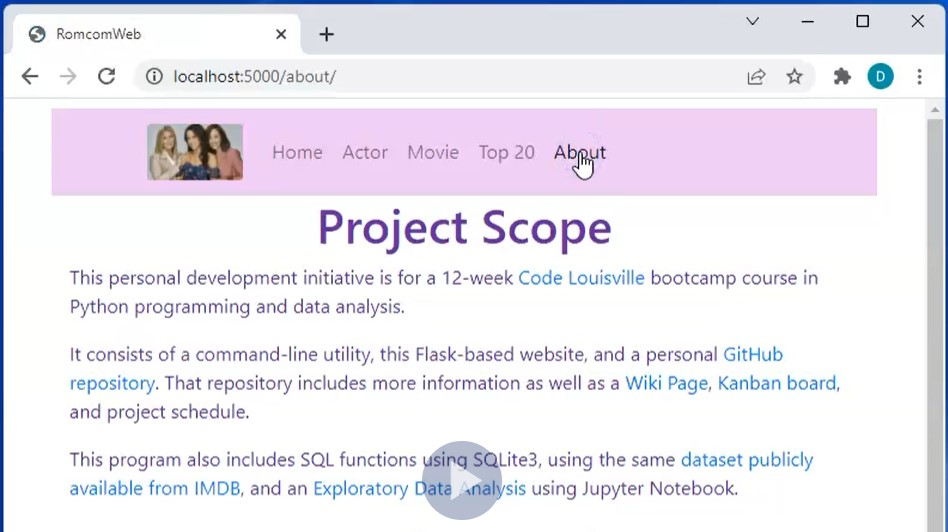

# OVERVIEW
This project uses a [subset of IMDB listed movies](https://github.com/hellums/lacey-bacon/blob/root/watchlist.txt) and actors from Hallmark original movies, romantic comedies, mysteries, and dramas. 

This repo is the result of a [Code Louisville](https://www.codelouisville.org/) course on Python programming and data analysis. It is a Flask version of a CLI program and uses data generated from it, and includes a Docker container. All websites and images shown here belong to the original copyright holders and are used for academic and demonstration purposes only. Source and derived data is [publicly available and courtesy of IMDB](https://www.imdb.com/interfaces/).

## FLASK WEB WALKTHROUGH VIDEO

## Mac/Linux instructions for command-line version:
(NOTE: Requires python version 3 and pip. The series of commands below will download the app, create a virtual environment, install python, pip, and the app's prerequisites in that virtual environment, and run the app using recently compiled data. 
  - >git clone https://github.com/hellums/python-flask.git
  - >cd python-flask
  - >python -m venv env
  - >source env/bin/activate
  - >pip install -r requirements.txt
  - >python romcomWeb.py
  - >in a web browser tab, go to http://localhost:5000/ 

## Windows instructions for command-line version:
If using VSC, a DOS command prompt terminal is highly recommended, NOT PowerShell.

Perform same steps as above, except replace the "source env/bin/activate" command in step 4 with 
  - >env\Scripts\activate (or activate.bat)

## To build a local Docker container: 
- > docker build -t python-flask .

## Clean Up
- To get everything back to normal and remove files, type deactivate, then remove the lacey-bacon directory. Your system will be back to normal, as before the test.

# Project-Related Github Pages
- [Kanban board](https://github.com/hellums/lacey-bacon/projects/1) for managing project schedule
- [Issues](https://github.com/hellums/lacey-bacon/issues) for incident management
- [Wiki](https://github.com/hellums/lacey-bacon/wiki/Data-Analytics-Course-Project) for related project links and information

